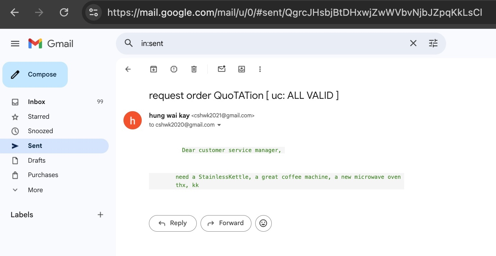
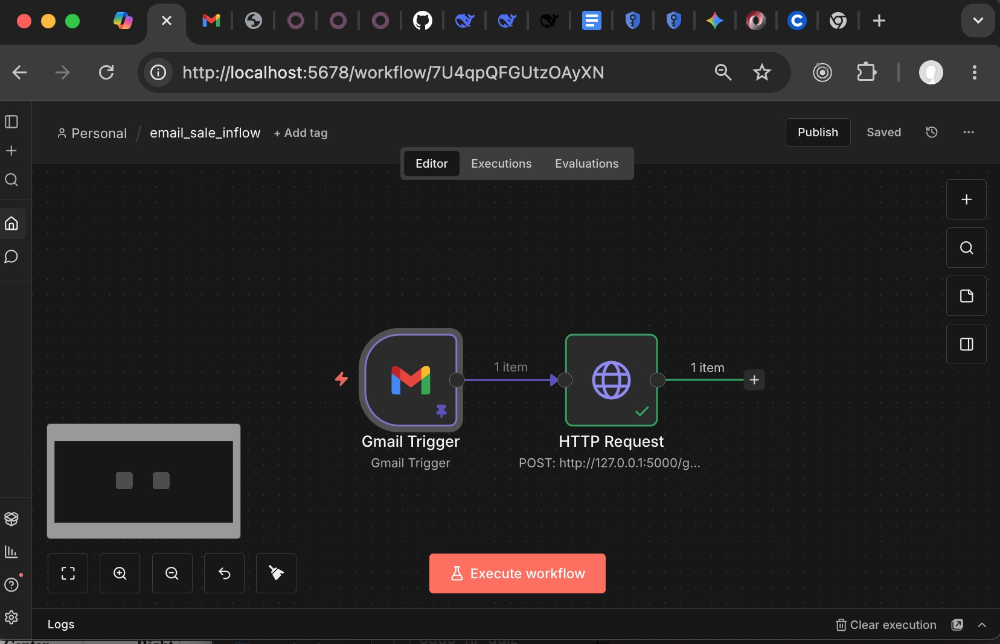
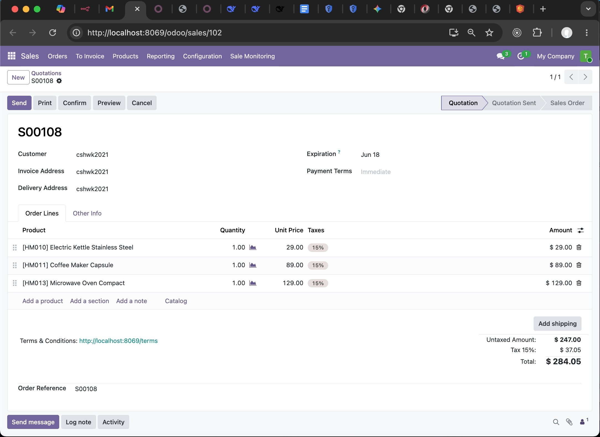
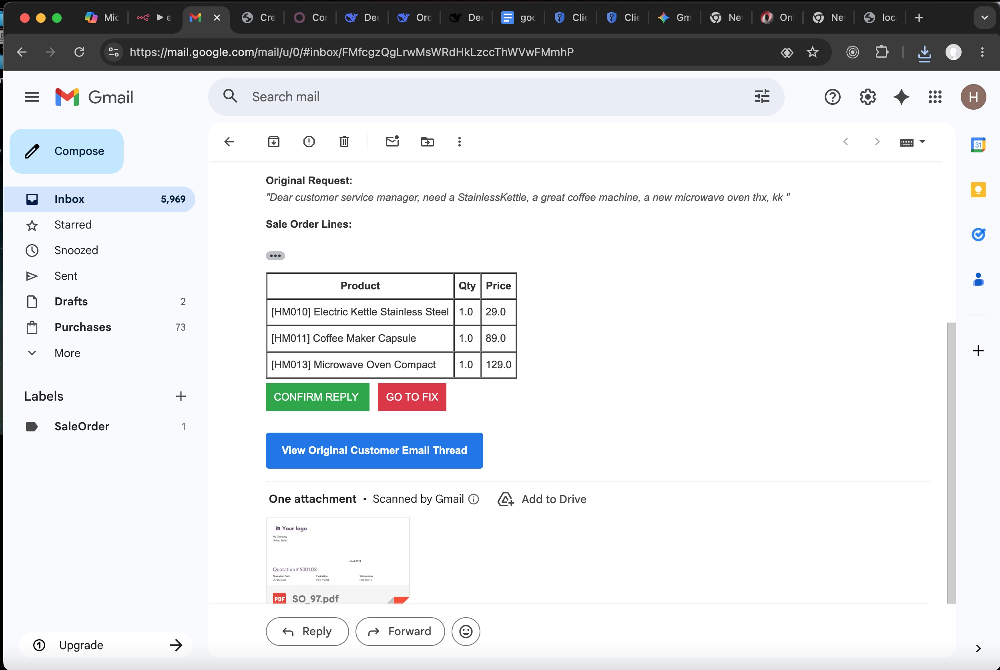
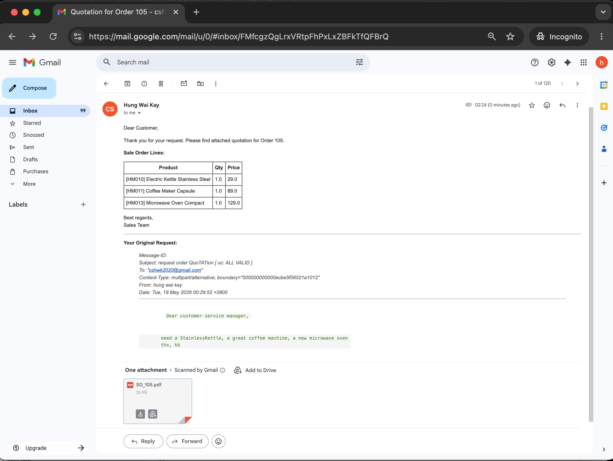
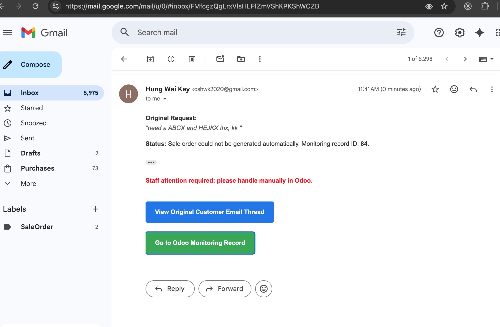
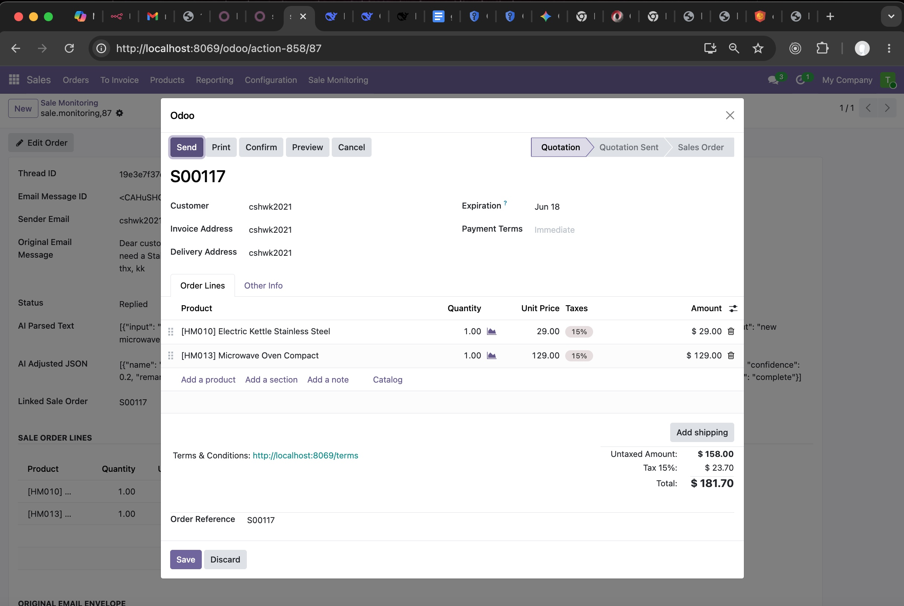
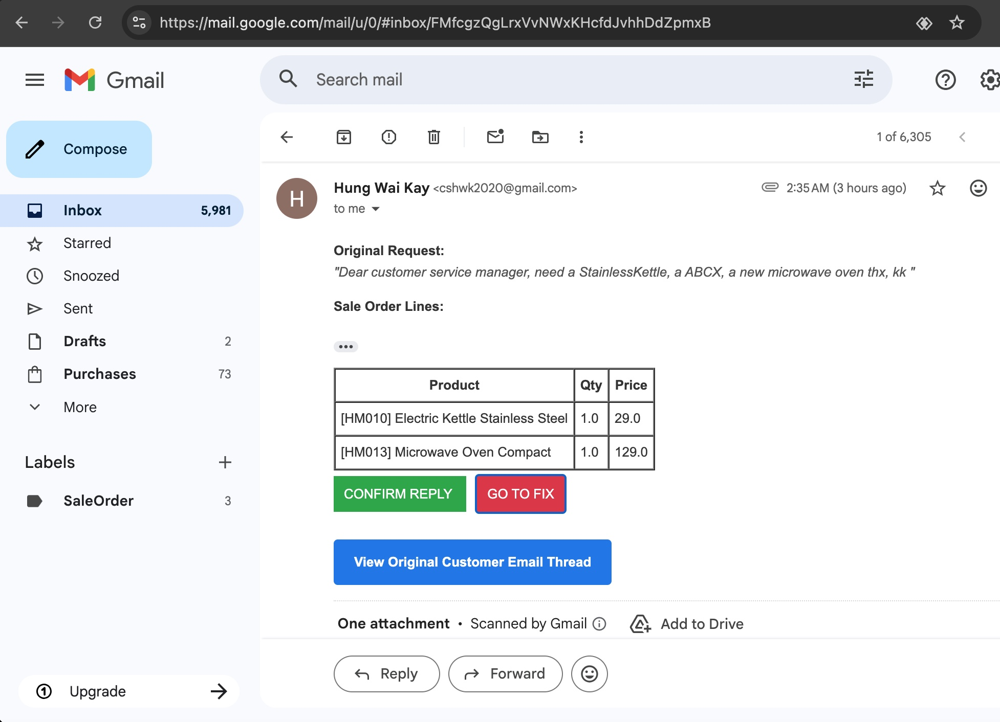
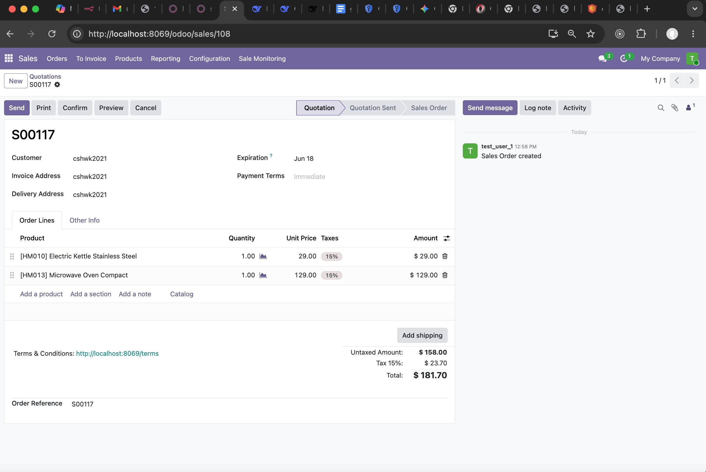
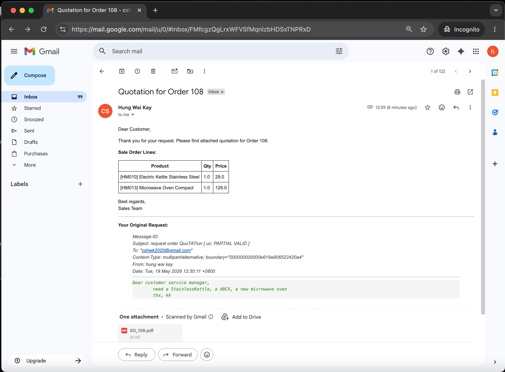

>## Portfolio Project: automate incoming email of sale request to draft ODOO sale quotation records

Introduction: 

- Sales teams often receive customer requests through email, 
which are usually unstructured and require manual entry into ERP systems. 

- This project addresses that challenge by building an automated pipeline 
that  can parse incoming emails, 
validate the extracted information, and generate draft quotations directly inside Odoo.

- The automation reduces repetitive manual work, improves accuracy, 
and ensures that staff only need to intervene when the email content is ambiguous. 
By connecting email intake, parsing, validation, and ERP integration, 
the workflow demonstrates how AI and automation can streamline sales order processing.


This project demonstrates how to use an automated pipeline to connect the flow:

Gmail Received ( N8N ) → Parser (LLM) → Matching ODOO products Embeddings (RAG) 
→ Auto-create Odoo Sale Order → Staff Gmail Reply | Manual Fix Odoo Sale Form And Reply.


Business Benefits:

- Reduce manual data entry
- Improve accuracy


Our Test Cases covering three different scenarios:

- All line items valid
- All line items invalid
- Some line items valid


---

> ## github repo

### - python flask microservice: 

after n8n received incoming gmail of dedicated staff email account, 
it will pass to python flask for processing the pipeline all the way 
from email body to auto-creating sale order records in ODOO backend.

[https://github.com/cshwk2020/odoo_sales/tree/main](https://github.com/cshwk2020/odoo_sales/tree/main)

- config.py : all important key configuration such as LLM ApiKey, odoo admin and password, etc.

- ms.py : microservice of python flask to receive webhook from n8n Gmail on_recv trigger. 

- ai_parse_utils.py : LLM parsing email body text into cleaned JSON list, and related mock LLM API functions.

- rag_mmr_utils.py : RAG matching cleaned JSON list with odoo product listing embedding in chroma vector store, and related mock RAG API functions.

- rag_upsert.py : ONCE OFF initial convert odoo product listing into embedding in chroma vector store. 

- odoo_utils.py : odoo related functions such as create sale order, etc.

- vault_utils.py : security hvac utils to get sensitive information such as LLM ApiKey and password from vault instead of hardcode in source code.

- test/* : unit testing by pytest -s


### - ODOO module : automation_sale_monitoring 
    
beside microservice, there is a ODOO module for staff to monitoring the automated sale email processing status, 
and manual edit and fix the sale order form 
when LLM has difficulty handling ambigous sale requests from email body.

[https://github.com/cshwk2020/odoo/tree/19.0/addons/automation_sale_monitoring](https://github.com/cshwk2020/odoo/tree/19.0/addons/automation_sale_monitoring)

---

workflow summary: 

[ Gmail on_received by N8N ] 

--> [ LLM Parse Email Body to JSON list of { product name , qty } ]

--> [ RAG matching JSON list with embedding of ODOO product listing of vector store chroma  ]

--> [ create ODOO Sale Monitoring record, optionally with FK linked to created sale order, 
if email body is clear enough to extract sale order details  ]

--> [ gmail to staff to either 

        ( confirm REPLY to quotation email ) 
        or 
        ( manual fix by navigate to ODOO Sale Monitoring record ) 
    ]


---

> ## workflow illustration with screenshots and simplfied code snippets

for full source code, please reference in our github repo. 

Here we simplfied code snippets by trimming away some details for improved readbility on core logic.


### - sale order email from potential buyer


 

### - n8n intercept the sale order email and pass to our microservice ms.py


 


### - our microservice ms.py, gmail_webhook start processing

```
@app.route("/gmail_webhook", methods=["POST"])
def gmail_webhook():
    
    email_data_json = request.json

    sender = ......
    receiver = ......
    subject = ......
    body = ......
    msg_id = ......
    threadid = ......

```
 
---

### - gmail_webhook extract email body and passed to AI

> email body input to LLM: 
```
Dear customer service manager, 
        
   need a StainlessKettle, a great coffee machine, a new microwave oven 
        
thx, 
kk
```

> LLM parsing:
```
headers = {
        "Authorization": f"Bearer {LLM_API_KEY}",
        "Content-Type": "application/json"
    }

    payload = {
        "model": LLM_API_MODEL_VER,
        "messages": [
            {
                "role": "system",
                "content": f"""
                    You are a parser that converts messy natural language order requests 
                    into JSON with fields: input, candidates, qty, status. 
                    Rules:
                    - Remove unnecessary filler words like 'I want', 'I need', 'please', 'give me'.
                    - Remove adjectives that describe product but are unhelpful for ERP product matching, 
                      such as 'good', 'best', 'great', 'nice', 'cheap'.
                    - If word is clear, status=exact with one candidate.
                    - If word is misspelled or ambiguous, status=ambiguous with multiple candidates.
                    - If consecutive words missing space, such as 'StainlessKettle', 
                        consider breaking them into 'Stainless', 'Kettle'.
                    - If remaining keywords, after adjusted for misspelled, 
                        still not a valid word in dictionary, 
                        then such word might be garbage, then status=not_found with empty candidates. .
                    - If no reasonable candidate exists, status=not_found with empty candidates.
                    - Always output valid JSON array.
                
                """
            },
            {
                "role": "user",
                "content": f"""
                Example output: {json.dumps(example_json, indent=2)}
                    Now convert this order request into JSON: {text_prompt}
                """
            }
        ],
        "temperature": 0.5,
        "response_format": {"type": "json_object"}  
    }


    response = requests.post(LLM_API_URL, headers=headers, json=payload)
    data = response.json()
 
    # DeepSeek response content
    content = .....
    parsed = json.loads(content)
    return parsed
```

> LLM parsed output: 
```
[
    {'input': 'StainlessKettle', 'candidates': ['stainless kettle'], 'qty': 1, 'status': 'exact'}, 
    {'input': 'a great coffee machine', 'candidates': ['coffee machine'], 'qty': 1, 'status': 'exact'}, 
    {'input': 'a new microwave oven', 'candidates': ['microwave oven'], 'qty': 1, 'status': 'exact'}
]

passed as parsed_items to next step of pipeline

```

---

### - RAG MMR match LLM-parsed JSON output with ODOO product listing embedding

> RAG initial once off prepare embedding from ODOO product listing in chroma vector store: 
```
tokenizer = AutoTokenizer.from_pretrained(PATH_MODEL)
model = AutoModel.from_pretrained(PATH_MODEL)

os.makedirs(PATH_CHROMA_STORE, exist_ok=True)
client = chromadb.PersistentClient(path=PATH_CHROMA_STORE)

collection = client.get_or_create_collection(name="odoo_products")

merged_products = {}

for p in products:
    code = p.get("default_code") or f"NO_CODE_{p['id']}"
    qty = p.get("qty_available", 0)
    text = f"{p.get('name') or ''} {code} {p.get('description') or ''}".strip()
    name = p.get("name")
    
    if code in merged_products:
        merged_products[code]["qty_available"] += qty
    else:
        merged_products[code] = {
            "name": name,
            "text": text,
            "vector": get_embedding(text),
            "odoo_id": p["id"],   
            "default_code": code,
            "qty_available": qty
        }

for code, data in merged_products.items():
    collection.upsert(
        ids=[code],  # use default_code as unique id
        embeddings=[data["vector"]],
        documents=[data["text"]],
        metadatas=[{
            "odoo_id": data["odoo_id"],
            "default_code": data["default_code"],
            "qty_available": data["qty_available"],
            "odoo_name": data["name"]
        }]
    )

```

> RAG: PER REQUEST matching AI parsed JSON with vector store odoo product embeddings
```
    embeddings = HuggingFaceEmbeddings(model_name=PATH_MODEL)

    os.makedirs(PATH_CHROMA_STORE, exist_ok=True)
    vectorstore = Chroma(
        collection_name="odoo_products",
        embedding_function=embeddings,
        persist_directory=PATH_CHROMA_STORE
    )
 
    retriever = vectorstore.as_retriever(
        search_type="mmr",
        search_kwargs={"k": 5, "lambda_mult": 0.5}
    )

    payload = payload = []
    for item in parsed_items:
        query_text = " ".join(item["candidates"])
        variations = retriever.invoke(query_text)
        payload.append({
            "input": item["input"],
            "qty": item["qty"],
            "status": item["status"],
            "candidates": [doc.page_content for doc in variations]
        })


    prompt = f"""
        You are given product line items with candidate matches:
        {payload}

        For each line item:
        - Select the best candidate, but before matching it need fix each line item wordings 
        according to these rules:
            Rules:
                - If product name has a typo, correct it to the closest valid candidate, 
                (e.g. "shiiping" → "shipping") where shipping appear in embeddings doc.
                - If the item has variants (small/medium/large) and user did not specify, 
                default to "Medium".
        - Compute confidence between 0 and 1:
            - 1 means top-1 is a clear winner (big gap with next).
            - 0 means top-1 and next are very close (hard to decide). 
        - Add a remark explaining the decision:
            - if confidence high, confidence >= 0.8, 
                then, as example, remark = "clear winner" 
            - if confidence low, , confidence < 0.6, 
                then, as example,  remark = "gap is tight, not safe"
            - else, is medium gap, as example, remark = "marginal safe"
            - based on ai assigned confidence, 
            ai need give corresponding remark to explain the confidence.
        - Add a status field:
            - "complete" if confidence >= 0.8
            - "incomplete" otherwise
            - "error" if any processing error occurred


        Return JSON in this example format (name is embedding metadatas name without code, 
        which is matched product name in embeddings) :
        [
            {{
                "name": "Corrugated Shipping Box Medium",
                "qty": 10,
                "confidence": 0.95,
                "remark": "clear winner",
                "status": "complete"
            }},
            {{
                "name": "Eco Paper Bag Medium",
                "qty": 1,
                "confidence": 0.55,
                "remark": "gap is not wide enough",
                "status": "incomplete"
            }},
            {{
                "name": "Men’s Hiking Boots",
                "qty": 1,
                "confidence": 0.8,
                "remark": "clear winner",
                "status": "complete"
            }}
        ]
        """


    prompt = f"""
        .....
        {payload}
        ......

    headers = {"Authorization": f"Bearer {LLM_API_KEY}"}
    resp = requests.post(LLM_API_URL, json={
            "model": LLM_API_MODEL_VER,
            "messages": [
                {"role":"system","content":"You are a helpful assistant."},
                {"role":"user","content": prompt}
            ],
            "temperature": 0
        }, 
        headers=headers,
        timeout=60 
    )

    resp_json = resp.json()

    content_str = resp_json[...]
    content_obj = json.loads(content_str)
```

> AI RAG MMR matching output: 
```
    [
        {
            "name": "Electric Kettle Stainless Steel",
            "qty": 1,
            "confidence": 0.95,
            "remark": "clear winner",
            "status": "complete"
        },
        {
            "name": "Coffee Maker Capsule",
            "qty": 1,
            "confidence": 0.95,
            "remark": "clear winner",
            "status": "complete"
        },
        {
            "name": "Microwave Oven Compact",
            "qty": 1,
            "confidence": 0.95,
            "remark": "clear winner",
            "status": "complete"
        }
    ]

    passed as sale_items to next step of pipeline
```

---

### - gmail_webhook use AI MMR RAG JSON output to create sale order in ODOO server

> ODOO create sale order : 
```
    sender = ......
    receiver = ......
    subject = ......
    body = ......
    msg_id = ......headers["message-id"]
    threadid = ......

    try:
        common = xmlrpc.client.ServerProxy(f"{ODOO_BASE_URL}/xmlrpc/2/common")
        uid = common.authenticate(ODOO_DB, odoo_user, odoo_pass, {})
        models = xmlrpc.client.ServerProxy(f"{ODOO_BASE_URL}/xmlrpc/2/object")

        order_lines = []
        for item in sale_items:
            if item["status"] == "complete":
                product_ids = models.execute_kw(
                    ODOO_DB, uid, odoo_pass,
                    "product.product", "search",
                    [[["name", "ilike", item["name"]]]],
                    {"limit": 1}
                )
                if product_ids:
                    order_lines.append((0, 0, {
                        "product_id": product_ids[0],
                        "product_uom_qty": item["qty"]
                    }))
     

        monitoring_vals = {
            "thread_id": threadid,
            "email_msg_id": msg_id,
            "sender_email": sender,
            "original_email_body": email_data_json,
            "ai_parse_text": json.dumps(parsed_items),
            "ai_mmr_json": json.dumps(sale_items),
        }

        
        if len(order_lines) == 0:

            # ALL sale line items INVALID, do not create sale order in ODOO
            # we create sale monitoring record in ODOO for staff to follow up
        
            # status is pending for staff to sale line items manually
            monitoring_vals["status"] = "pending_fix"
            monitoring_vals = safe_dict(monitoring_vals)
          
            create_monitoring_result = models.execute_kw(
                ODOO_DB, uid, odoo_pass,
                "sale.monitoring", "create_monitoring_only",
                [monitoring_vals]
            )

            create_monitoring_result = safe_dict(create_monitoring_result)
            monitoring_id = create_monitoring_result.get("monitoring_id")
 
            return_json = {
                    "status": False, 
                    "msg": "No valid items to create order",
                    "monitoring_id": monitoring_id
                }

            return return_json

        else:

            # SOME sale line items VALID, create sale order in ODOO
            # we create sale monitoring record in ODOO for staff to review
        
            vals_order = {
                "partner_id": partner_id,
                "order_line": order_lines
            }
            monitoring_vals["status"] = "pending_reply"
            #
            vals_order = safe_dict(vals_order)
            monitoring_vals = safe_dict(monitoring_vals)
            # 
            create_order_result = models.execute_kw(
                ODOO_DB, uid, odoo_pass,
                "sale.monitoring", "create_order_with_monitoring",
                [vals_order, monitoring_vals]
            )

            if create_order_result.get("status") == True:

                order_id = create_order_result.get("order_id")

                create_pdf_result = create_sale_order_pdf(odoo_user, odoo_pass, order_id)

                pdf_base64 = create_pdf_result.get("msg")

                return {
                    "status": True,
                    "msg": f"Sale order {order_id} created",
                    "order_id": order_id,
                    "attachment": pdf_base64
                }

            else:
                return create_order_result
                
     
    except Exception as e:
        return {"status": False, "msg": str(e)}

```


> sale order created in ODOO backend


 


> odoo sale monitoring record also created for staff to follow up


  


---

### - gmail_webhook after created sale order, send email notification ( with original email body and created odoo sale order line items ) to staff for compare, review and reply if correct  

> gmail to staff to either:
    [ confirm REPLY to quotation email ] 
    OR 
    [ manual fix by going to ODOO Sale Monitoring record ]



 

```
def send_notify_email(staff_email, sale_order_id, email_data_json):

    odoo_user = vault_get_odoo_user()
    odoo_pass = vault_get_odoo_pass()

    subject = email_data_json.get("subject", "No Subject")
    original_text = (
        email_data_json.get("text")
        or email_data_json.get("html")
        or email_data_json.get("textAsHtml")
        or ""
    )
    msg_id = email_data_json.get("messageId")
    threadid = email_data_json.get("threadId")
    gmail_id = email_data_json.get("id")   

    # Gmail shortcut URL
    if gmail_id:
        gmail_shortcut_url = f"https://mail.google.com/mail/u/0/#inbox/{gmail_id}"
    elif threadid:
        gmail_shortcut_url = f"https://mail.google.com/mail/u/0/#inbox/{threadid}"
    else:
        gmail_shortcut_url = "https://mail.google.com/mail/u/0/#inbox"

    # 自動生成 order_lines
    order_lines = get_sale_order_lines(odoo_user, odoo_pass, sale_order_id)

    lines_html = "".join([
        f"<tr><td>{l['product']}</td><td>{l['qty']}</td><td>{l['price']}</td></tr>"
        for l in order_lines
    ])

    confirm_url = f"http://127.0.0.1:5000/confirm_reply/{sale_order_id}"
    fix_url = f"http://127.0.0.1:8069/odoo/sales/{sale_order_id}"

    html_body = f"""
    <div style="font-family: Arial, sans-serif; line-height: 1.6; color: #333;">
        <p><b>Original Request:</b><br><i style="color: #555;">"{original_text}"</i></p>
        <p><b>Sale Order Lines:</b></p>
        <table border="1" cellpadding="5" cellspacing="0">
            <tr><th>Product</th><th>Qty</th><th>Price</th></tr>
            {lines_html}
        </table>
        <p>
            <a href="{confirm_url}" style="background:#28a745;color:white;padding:10px;text-decoration:none;">
                CONFIRM REPLY
            </a>
            &nbsp;&nbsp;
            <a href="{fix_url}" style="background:#dc3545;color:white;padding:10px;text-decoration:none;">
                GO TO FIX
            </a>
        </p>
        <br>
        <a href="{gmail_shortcut_url}" target="_blank"
           style="background-color: #1a73e8; color: white; padding: 12px 20px;
                  text-decoration: none; font-weight: bold; border-radius: 4px;
                  display: inline-block; box-shadow: 0 1px 3px rgba(0,0,0,0.2);">
            View Original Customer Email Thread
        </a>
    </div>
    """

    # MIME message container
    mime_msg = MIMEMultipart()
    clean_subject = subject if subject.lower().startswith("re:") else f"Re: {subject}"
    mime_msg["To"] = staff_email
    mime_msg["Subject"] = clean_subject

    if msg_id:
        mime_msg["In-Reply-To"] = msg_id
        mime_msg["References"] = msg_id

    mime_msg.attach(MIMEText(html_body, "html"))

    # Attach PDF quotation (ensure bytes, not dict)
    pdf_path = f"./pdf/SO_{sale_order_id}.pdf"
    if os.path.exists(pdf_path):
        with open(pdf_path, "rb") as f:
            pdf_bytes = f.read()  # raw bytes

        part = MIMEBase("application", "pdf")
        part.set_payload(pdf_bytes)   # 必須係 bytes
        encoders.encode_base64(part)  # 第一層：附件合法化
        part.add_header("Content-Disposition", f'attachment; filename="SO_{sale_order_id}.pdf"')
        mime_msg.attach(part)

    # Gmail API 要求：整封 MIME message再 base64-url-safe encode
    raw_string = base64.urlsafe_b64encode(mime_msg.as_bytes()).decode("utf-8")
    final_api_message = {"raw": raw_string}
    if threadid:
        final_api_message["threadId"] = threadid

    gmail_send(final_api_message)

```
 
---


> staff gmail clicked to [ CONFIRM REPLY ] email to sender

> email sender received sale quotation with pdf attachemnt from staff


 

```
@app.route("/confirm_reply_process/<int:order_id>", methods=["GET"])
def confirm_reply_process(order_id):
    odoo_user = ......
    odoo_pass = ......
    try:
        # 生成 PDF
        pdf_result = create_sale_order_pdf(odoo_user, odoo_pass, order_id)
        if not pdf_result.get("status"):
            return f"PDF generation failed: {pdf_result.get('msg')}", 500

        pdf_data = base64.b64decode(pdf_result.get("msg"))
        filepath = f"./pdf/SO_{order_id}.pdf"
        os.makedirs("./pdf", exist_ok=True)
        with open(filepath, "wb") as f:
            f.write(pdf_data)

        # 取 order lines via XML-RPC
        order_lines = get_sale_order_lines(odoo_user, odoo_pass, order_id)
        lines_html = "".join([
            f"<tr><td>{l['product']}</td><td>{l['qty']}</td><td>{l['price']}</td></tr>"
            for l in order_lines
        ])

        # 取 monitoring record via XML-RPC
        monitoring = get_sale_monitoring_record(odoo_user, odoo_pass, order_id)
        raw_body = monitoring.get("original_email_body") if monitoring else None
        original_body = ......
        customer_email = ......
        if not customer_email:
            return ......

        # 建立 email HTML body
        body_html = f"""
        <p>Dear Customer,</p>
        <p>Thank you for your request. Please find attached quotation for Order {order_id}.</p>
        <p><b>Sale Order Lines:</b></p>
        <table border="1" cellpadding="5" cellspacing="0">
            <tr><th>Product</th><th>Qty</th><th>Price</th></tr>
            {lines_html}
        </table>
        <p>Best regards,<br>Sales Team</p>
        <hr>
        <p><b>Your Original Request:</b></p>
        <blockquote style="color:#555; font-style:italic;">
            {original_body}
        </blockquote>
        """

        # send email (MIME + PDF attach)
        mime_msg = MIMEMultipart()
        mime_msg["To"] = customer_email
        mime_msg["Subject"] = f"Quotation for Order {order_id}"
        mime_msg.attach(MIMEText(body_html, "html"))

        with open(filepath, "rb") as f:
            pdf_bytes = f.read()
        part = MIMEBase("application", "pdf")
        part.set_payload(pdf_bytes)
        encoders.encode_base64(part)
        part.add_header("Content-Disposition", f'attachment; filename="SO_{order_id}.pdf"')
        mime_msg.attach(part)

        raw_string = base64.urlsafe_b64encode(mime_msg.as_bytes()).decode("utf-8")
        final_api_message = {"raw": raw_string}
        gmail_send(final_api_message)

        # 更新 status to FROM PENDING to REPLIED
        update_sale_monitoring_status(odoo_user, odoo_pass, order_id)

        return render_template_string("""
            <div class="alert alert-success" role="alert">
            Reply sent to {{customer_email}} for Order {{order_id}}, PDF attached.<br>
            </div>
            """, customer_email=customer_email, order_id=order_id)

    except Exception as e:
        return render_template_string("""
            <div class="alert alert-danger" role="alert">
            Error generating reply: {{error}}
            </div>
            """, error=str(e)), 500

```

---

> OR staff might choose to click [ GO TO FIX ] button in gmail to edit ODOO sale order form before reply to email sender 


---
---


## Appendix: Three Major Test Cases

> ### TEST CASE 1: All email requested sale line items FOUND

**Email Body:**
```
Dear customer service manager, 
        
   need a StainlessKettle, a great coffee machine, a new microwave oven 
        
thx, kk
```

**ODOO sale order record auto-created in backend:**


**Gmail notification for staff to CONFIRM REPLY:**


**Sender received Gmail REPLY from staff:**


---


> ### TEST CASE 2: All email requested sale line items NOT FOUND

**Email Body:**
```
Dear customer service manager, 
        
    need a ABCX and HEJKX
    
thx, kk
```

**Gmail notification for staff to manual fix:**




---

> ### TEST CASE 3: Some email requested sale line items FOUND, but some NOT FOUND

**Email Body:**
```
Dear customer service manager, 
        
        need a StainlessKettle, a ABCX, a new microwave oven 
        
thx, kk
```

**ODOO partial sale order record auto-created in backend:**




**Gmail notification for staff to MANUAL FIX OR CONFIRM REPLY:**




**staff choose manual fix to edit sale order form in ODOO and then send reply:**




**Sender received Gmail REPLY from staff:**




---
---

## Appendix: LLM Token Cost minimalization ~ use MOCK API CALL

> MODE_REAL = False

> SCENARIO = Scenario.VALID | Scenario.INVALID | Scenario.PARTIAL

```
from enum import Enum

class Scenario(Enum):
    INVALID = "invalid"
    VALID = "valid"
    PARTIAL = "partial"

# REAL AI CALL OR MOCK 
MODE_REAL = True
# TEST CASES: INVALID / VALID / PARTIAL
SCENARIO = Scenario.PARTIAL

```

> Mocking LLM Parsing Email Body
```
def run_ai_convert_text_to_json(text_prompt):

    if MODE_REAL:
        return real_ai_convert_text_to_json(text_prompt)
    else:
        if SCENARIO is Scenario.INVALID:
            return mock_all_invalid__ai_convert_text_to_json(text_prompt)
        elif SCENARIO is Scenario.VALID:
            return mock_all_valid__ai_convert_text_to_json(text_prompt)
        elif SCENARIO is Scenario.PARTIAL:
            return mock_partial_valid__ai_convert_text_to_json(text_prompt)


def mock_all_invalid__ai_convert_text_to_json(text_prompt):
     # UC: ALL sale line items NOT FOUND
     # email input: need a ABCX and HEJKX thx, kk
    return [
        {
            "input": "ABCX",
            "candidates": [],
            "qty": 1,
            "status": "not_found"
        },
        {
            "input": "HEJKX",
            "candidates": [],
            "qty": 1,
            "status": "not_found"
        }
    ]

def mock_all_valid__ai_convert_text_to_json(text_prompt):
    # UC: ALL sale line items FOUND
    # email input: need a StainlessKettle, a great coffee machine, a new microwave oven 
    return [
        {'input': 'StainlessKettle', 'candidates': ['stainless kettle'], 'qty': 1, 'status': 'exact'}, 
        {'input': 'a great coffee machine', 'candidates': ['coffee machine'], 'qty': 1, 'status': 'exact'}, 
        {'input': 'a new microwave oven', 'candidates': ['microwave oven'], 'qty': 1, 'status': 'exact'}
    ]

def mock_partial_valid__ai_convert_text_to_json(text_prompt):
    # UC: some sale line items FOUND, some NOT FOUND
    # email input: eed a StainlessKettle, a ABCX, a new microwave oven 
    return [
        {'input': 'StainlessKettle', 'candidates': ['Stainless Kettle'], 'qty': 1, 'status': 'exact'}, 
        {'input': 'ABCX', 'candidates': [], 'qty': 1, 'status': 'not_found'}, 
        {'input': 'new microwave oven', 'candidates': ['microwave oven'], 'qty': 1, 'status': 'exact'}
    ]

```

> Mocking RAG MMR matching query parsed JSON list with ODOO product listing embedding in chroma vectore store 
```
def run_mmr_pipeline(parsed_items): 

    if MODE_REAL:
        return real_mmr_pipeline(parsed_items)
    else:
        if SCENARIO is Scenario.INVALID:
            return mock_all_invalid__mmr_pipeline(parsed_items)
        elif SCENARIO is Scenario.VALID:
            return mock_all_valid__mmr_pipeline(parsed_items)
        elif SCENARIO is Scenario.PARTIAL:
            return mock_partial_valid__mmr_pipeline(parsed_items)


def mock_all_invalid__mmr_pipeline(parsed_items):
    # UC: ALL sale line items NOT FOUND
    # email input: need a ABCX and HEJKX thx, kk
    return [
        {'name': None, 'qty': 1, 'confidence': 0.0, 'remark': 'no candidates found', 'status': 'error', 'input': 'ABCX'}, 
        {'name': None, 'qty': 1, 'confidence': 0.0, 'remark': 'no candidates found', 'status': 'error', 'input': 'HEJKX'}
    ]


def mock_all_valid__mmr_pipeline(parsed_items):
    # UC: ALL sale line items FOUND
    # email input: need a StainlessKettle, a great coffee machine, a new microwave oven 
    return [
        {
            "name": "Electric Kettle Stainless Steel",
            "qty": 1,
            "confidence": 0.95,
            "remark": "clear winner",
            "status": "complete"
        },
        {
            "name": "Coffee Maker Capsule",
            "qty": 1,
            "confidence": 0.95,
            "remark": "clear winner",
            "status": "complete"
        },
        {
            "name": "Microwave Oven Compact",
            "qty": 1,
            "confidence": 0.95,
            "remark": "clear winner",
            "status": "complete"
        }
    ]


def mock_partial_valid__mmr_pipeline(parsed_items):
    # UC: some sale line items FOUND, some NOT FOUND
    # email input: eed a StainlessKettle, a ABCX, a new microwave oven 
    return [
        {
            "name": "Electric Kettle Stainless Steel",
            "qty": 1,
            "confidence": 0.95,
            "remark": "clear winner",
            "status": "complete"
        },
        {
            "name": "Unisex Hoodie Graphic",
            "qty": 1,
            "confidence": 0.2,
            "remark": "gap is tight, not safe",
            "status": "incomplete"
        },
        {
            "name": "Microwave Oven Compact",
            "qty": 1,
            "confidence": 0.95,
            "remark": "clear winner",
            "status": "complete"
        }
    ]

```


---
---

## Appendix: Security ~ Avoid sensitive information such as password or LLM ApiKey to be exposed in source code

> Vault

vault server -dev

```
You may need to set the following environment variables:

    $ export VAULT_ADDR='http://127.0.0.1:8200'

The unseal key and root token are displayed below in case you want to
seal/unseal the Vault or re-authenticate.

Unseal Key: AR....................9Ml0pZURL8D0=
Root Token: hvs..................59

Development mode should NOT be used in production installations!

```

```
export VAULT_ADDR='http://127.0.0.1:8200'
# replace with your root token
export VAULT_TOKEN='hvs..................59'

vault secrets enable -path=secret kv

vault kv put secret/app \
    odoo_user="........." \
    odoo_pass="........." \
    deepseek_key="sk-8a42ed.................a3241"

```

###  
```
import hvac

client = hvac.Client(
    url=os.environ["VAULT_ADDR"],
    token=os.environ["VAULT_TOKEN"]
)

def vault_get_secret(path):
    return client.secrets.kv.read_secret_version(path=path)["data"]["data"]


def vault_get_odoo_user():
   
    app_secrets = vault_get_secret("app")
    odoo_user = app_secrets["odoo_user"]
    print("Odoo user:", odoo_user)
    return odoo_user
  
 
def vault_get_odoo_pass():
 
    app_secrets = vault_get_secret("app")
    odoo_pass = app_secrets["odoo_pass"]
    print("Odoo pass:", odoo_pass)
    return odoo_pass
 
 
def vault_get_deepseek_key():
 
    app_secrets = vault_get_secret("app")
    deepseek_key = app_secrets["deepseek_key"]
    print("DeepSeek key:", deepseek_key)
    return deepseek_key
```


---
---

## Appendix: Next Future Iteration

- For current iteration, we focus in automation pipeline of N8N--FLASK--LLM--RAG--ODOO.


>  For next iteration, we focus in API Security Improvement

- Email URLs, [ Reply Link ] and [ Manual Fix ] need to be protected by Google cloud callback 
or other security mechanism such as JWT.


